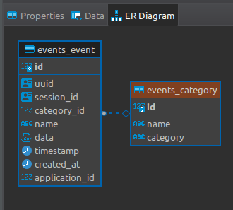

# the-eye

## REST Application: Start Project

```shell
# Create an env file in root
$ cp .env.default .env

# Add enviroments values in this file.

# Python path
$ which python3

# Create virtual enviroment
$ virtualenv --python='/usr/bin/python3' .venv

# Activate virtual enviroment
$ source .venv/bin/activate 

# Install requirements
$ make install

# Run database 
$ make psql_start

# Create and apply migrations 
$ make db

# Run project
$ make run

System check identified no issues (0 silenced).
April 08, 2022 - 16:16:22
Django version 4.0.3, using settings 'config.settings.base'
Starting development server at http://127.0.0.1:8000/
Quit the server with CONTROL-C.
```


### API
The endpoints created.

**POST /api/v1/events/**: Save a new event.


**Header**
| Fields      | Type      | Required |
|-------------|-----------|----------|
| application | str(UUID) | Yes      |

**Body**
| Fields     | Type      | Required |
|------------|-----------|----------|
| session_id | str(UUID) | Yes      |
| category   | str       | Yes      |
| name       | str       | Yes      |
| data       | dict      | Yes      |
| timestamp  | timestamp | Yes      |

Examples:
```
# Request
curl --location --request POST 'http://127.0.0.1:8000/api/v1/events/' \
--header 'application: 0e302fce-66ad-4721-911e-0ab9d33697bf' \
--header 'Content-Type: application/json' \
--data-raw '{
    "session_id": "e2085be5-9137-4e4e-80b5-f1ffddc25423",
    "category": "page interaction",
    "name": "pageview",
    "data": {
        "host": "www.consumeraffairs.com",
        "path": "/"
    },
    "timestamp": "2021-01-01 09:15:27.243860"
}'


# Response
# 201
{
    "session_id": "e2085be5-9137-4e4e-80b5-f1ffddc25423",
    "category": "page interaction",
    "name": "pageview",
    "data": {
        "host": "www.consumeraffairs.com",
        "path": "/"
    },
    "timestamp": "2021-01-01T09:15:27.243860Z"
}
```

Errors
```
# Request
curl --location --request POST 'http://127.0.0.1:8000/api/v1/events/' \
--header 'application: 0e302fce-66ad-4721-911e-0ab9d33697bf' \
--header 'Content-Type: application/json' \
--data-raw '{
    "session_id": "e2085be5-9137-4e4e-80b5-f1ffddc25423",
    "category": "page interaction",
    "timestamp": "2021-01-01 09:15:27.243860"
}'


# Response
# 400
{
    "session_id": [
        "event with this session id already exists."
    ],
    "name": [
        "This field is required."
    ],
    "data": [
        "This field is required."
    ]
}
```


---
## Workflow
### Entities

I created two entities:
- Application: to represent the application that is sending the event. This table should contains all the "trusted clients".
- Event: represent the event to be saved.
    - the date field that will contain all event payload information.
    - category field today is a char field but is better a list of known categories as a way to standardize them.



## Constraints & Requirements

> "The Eye" will be receiving, in average, ~100 events/second, so consider not processing events in real time

> When Applications talk to "The Eye", make sure to not leave them hanging
- Improve the view to use async save to release the request.

> Your models should have proper constraints to avoid race conditions when multiple events are being processed at the same time
- This is a point that I need to study.


## TODO LIST
- [ ] Appllications can send events for the same session.
- [ ] Different types of Events (identified by category + name) can have different validations for their payloads.
- [ ] Improve the view to use async function to save a event this way releasing the request.
- [ ] Add Swagger.
- [ ] Add docker for django application.
